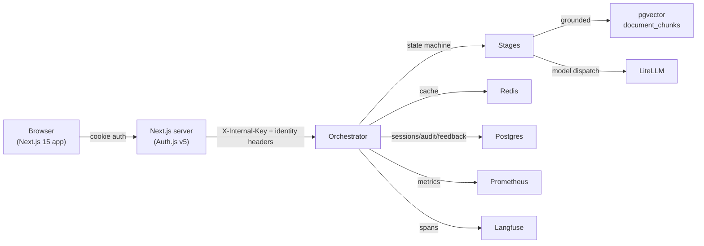

# Meridian

Production-grade enterprise knowledge assistant. Deterministic LLM
orchestration, grounded retrieval, multi-tenant SaaS shell, observable +
cost-aware dispatch, and a full guardrail / audit / eval stack.

> **Recruiter-facing summary.** Meridian is a real production
> orchestrator — not a chat demo. It ships:
>
> - Deterministic state-machine orchestration (classify → retrieve → assemble → dispatch → validate → guardrail → shape).
> - Grounded Q&A backed by tenant-scoped pgvector ingestion.
> - Tenant isolation: every chat/session/document/audit/usage row is
>   workspace-scoped; the orchestrator never trusts browser-supplied
>   identity.
> - Distributed rate limiter + per-workspace cost breaker over Redis.
> - Input + output guardrails (regex PII always-on; LlamaGuard / Patronus
>   Lynx pluggable by env var).
> - Observability: Prometheus metrics with `(workspace, action)` labels,
>   durable Postgres audit log, Langfuse traces, OpenTelemetry spans.
> - Auto-generated TypeScript contracts so the Next.js frontend can never
>   silently drift from the Python wire types.

---

## Architecture (mermaid)



---

## Project layout

```
meridian/
├── apps/
│   └── web/                   Next.js 15 SaaS shell (App Router, Auth.js v5)
├── packages/                  Shared Python libraries
│   ├── contracts/             Pydantic v2 wire types (source of TS gen)
│   ├── cost-accounting/       CostAccountant + RedisDailyTracker + WorkspaceCostBreaker
│   ├── db/                    SQLAlchemy ORM + Alembic-managed schema
│   ├── guardrails/            Regex PII + LlamaGuard + Patronus Lynx
│   ├── ingestion/             PDF/text → chunk → embed → tenant-scoped pgvector
│   ├── ops/                   Errors + RateLimiter Protocol (in-mem + Redis)
│   ├── prompt-assembler/      Token-budgeted prompt assembly
│   ├── semantic-cache/        Postgres + in-memory cache, OpenAI/static embeddings
│   ├── session-store/         Redis-backed conversation history
│   └── ...
├── services/
│   ├── orchestrator/          Deterministic state machine + FastAPI surface
│   │                          → wiring.py builds every dependency from env
│   ├── prompt-registry/       Postgres-backed versioned prompts
│   ├── retrieval-client/      External RAG client (or local pgvector)
│   ├── tool-executor/         Workflow-step abstraction (Phase 4 work)
│   └── evaluator/             Regression + golden + online sampling
├── migrations/versions/       Alembic chain (0001 → 0007)
├── scripts/                   export_schemas.py, red_team.py, smoke, …
├── docker-compose.yml         Postgres+pgvector, Redis, LiteLLM, Langfuse v3
└── pyproject.toml             uv workspace root
```

Pointers: [`ARCHITECTURE.md`](./ARCHITECTURE.md), [`CONTRACTS.md`](./CONTRACTS.md), [`ORCHESTRATION.md`](./ORCHESTRATION.md), [`PROMPTS.md`](./PROMPTS.md), [`GUARDRAILS.md`](./GUARDRAILS.md), [`EVALS.md`](./EVALS.md), [`OPERATIONS.md`](./OPERATIONS.md), [`STAGING.md`](./STAGING.md), [`SECURITY-REVIEW.md`](./SECURITY-REVIEW.md), [`LAUNCH.md`](./LAUNCH.md), [`OPTIMIZATION.md`](./OPTIMIZATION.md), [`v2-roadmap.md`](./v2-roadmap.md), [`tasks/todo.md`](./tasks/todo.md).

---

## Local setup

### Prerequisites
- Python 3.12, [`uv`](https://github.com/astral-sh/uv) ≥ 0.10
- Node 22, `pnpm` ≥ 10
- Docker Desktop / Colima

### Backend
```bash
make sync                                # uv sync --all-extras
cp .env.example .env                     # fill secrets (Anthropic, OpenAI, Langfuse)
make up                                  # postgres+pgvector, redis, litellm, langfuse
make migrate                             # alembic upgrade head — chain runs through 0007
make check                               # ruff + mypy + pytest (mirrors CI)
```

### Web app
```bash
cd apps/web
pnpm install --frozen-lockfile
pnpm gen-types                           # regenerate TS from Pydantic schemas
pnpm typecheck && pnpm lint && pnpm test && pnpm build
pnpm dev                                 # Next.js on :3001 (proxies to orchestrator on :8000)
```

### Required env vars (orchestrator)
```
MERIDIAN_ENV=staging|production|dev|test
ORCH_INTERNAL_KEY=<high-entropy>         # required in staging/prod
DATABASE_URL=postgresql+psycopg://…       # gates Postgres-backed sessions/audit/feedback/cache
REDIS_URL=redis://…                       # enables distributed rate limiter + spend tracker
LITELLM_BASE_URL=…                        # model gateway
RAG_BASE_URL=…                            # optional — external retrieval (else local pgvector)
OPENAI_API_KEY=…                          # optional — real embeddings (else deterministic static)
LLAMA_GUARD_BASE_URL / _API_KEY           # optional input guardrail
PATRONUS_API_KEY                          # optional output guardrail
MERIDIAN_DAILY_BUDGET_USD=100             # global cost breaker
MERIDIAN_WORKSPACE_DAILY_BUDGET_USD=…     # per-workspace breaker
MERIDIAN_RATELIMIT_BURST=30
MERIDIAN_RATELIMIT_PER_SECOND=1
MERIDIAN_RATELIMIT_BYPASS_WORKSPACES=     # CSV admin overrides
MERIDIAN_BUDGET_BYPASS_WORKSPACES=        # CSV admin overrides
```

The orchestrator **fails closed** when running with `MERIDIAN_ENV=staging|production` and `ORCH_INTERNAL_KEY` is unset. Local dev bypass requires both `MERIDIAN_ENV=dev` *and* `MERIDIAN_ALLOW_UNAUTH_INTERNAL=true`.

---

## Production deployment

The repo ships Fly.io configs (`fly.toml`, `docker-compose.staging.yml`) and a Vercel-friendly Next.js app. Suggested stack:

| Layer        | Service                        | Notes                                        |
|--------------|--------------------------------|----------------------------------------------|
| Web          | Vercel                         | Auth.js cookie session, Edge middleware      |
| Orchestrator | Fly.io / Railway / Render      | Uvicorn behind a private network             |
| Postgres     | Neon / Supabase / RDS          | pgvector extension required                  |
| Redis        | Upstash / Elasticache          | Used for sessions, rate limit, spend tracker |
| LiteLLM      | Self-host (compose) or managed | Provider failover lives here                 |
| Langfuse     | `docker-compose.yml`           | Web + worker + clickhouse + minio            |

Secrets handling — never bake provider keys into images. Use Fly secrets / Vercel env / Doppler. The orchestrator's `/debug/config` endpoint surfaces a *redacted capability map* admins can use to verify what's wired without leaking secrets.

---

## Testing

| Surface            | Command                                              |
|--------------------|------------------------------------------------------|
| Python lint        | `uv run ruff check .`                                |
| Python format      | `uv run ruff format --check .`                       |
| Python types       | `uv run mypy -p meridian_orchestrator …`             |
| Python unit tests  | `uv run pytest -q`                                   |
| Migrations apply   | `uv run --group migrations alembic upgrade head`     |
| Compose config     | `docker compose config --quiet`                      |
| Smoke (HTTP)       | `python scripts/staging_smoke.py --allow-degraded`   |
| Red-team sweep     | `python scripts/red_team.py`                         |
| Load test          | `python scripts/load_test.py`                        |
| Web typecheck      | `cd apps/web && pnpm typecheck`                      |
| Web lint           | `cd apps/web && pnpm lint`                           |
| Web tests          | `cd apps/web && pnpm test`                           |
| Web build          | `cd apps/web && pnpm build`                          |
| Schema drift check | `cd apps/web && pnpm gen-types && git diff --exit-code apps/web/lib/generated` |

CI runs all of these on every PR — see `.github/workflows/ci.yml`.

**Test count:** Python 283 / Web 14 / all green as of Phase 7.

---

## Production readiness checklist

- [x] Auth (Auth.js v5) + tenant model (users, workspaces, memberships, RBAC)
- [x] Internal-key fail-closed enforcement on every protected route
- [x] Server-side chat sessions + messages + feedback + audit + usage
- [x] Tenant-scoped retrieval (contextvar — cross-tenant reads unrepresentable)
- [x] Distributed rate limiter (Redis Lua, atomic) with per-(workspace, user, action) keys
- [x] Per-workspace cost breaker over a Redis-backed daily tracker
- [x] Input + output guardrails wired in production wiring (`wiring.py`)
- [x] Durable feedback store (Postgres) and audit sink (Postgres)
- [x] Production semantic cache (pgvector) with tenant + doc-version partition keys
- [x] Document ingestion: PDF + text + markdown → pgvector, workspace-scoped
- [x] Admin-gated `/debug/config` returning a *redacted* capability map
- [x] Auto-generated TypeScript contracts (drift-checked in CI)
- [x] Web app in CI (typecheck · lint · test · build)
- [x] Prometheus metrics with `(workspace, action)` labels
- [x] Red-team corpus + offline regression on every PR
- [ ] Real PDF OCR pipeline for image-only PDFs (deferred; see `tasks/web-plan.md`)
- [ ] Per-workspace budget UI (Phase 8 follow-up)

---

## Architectural decisions locked in for v1

From Section 19 of the execution plan:

- **Multi-provider via LiteLLM gateway** — Anthropic + OpenAI, Anthropic priority 1.
- **Prompt registry in Postgres** — versioned, immutable rows; rollback via activation flip.
- **Three-tier model routing** — `meridian-small` / `meridian-mid` / `meridian-frontier`.
- **Hand-rolled deterministic state machine** — no LangGraph/Temporal.
- **RAG consumed, not built** when `RAG_BASE_URL` is set; **local pgvector** otherwise.
- **Synchronous tool execution** — async deferred to v2.
- **Self-hosted Langfuse v3** — web + worker + clickhouse + minio.

---

## Screenshots

`docs/screenshots/` is the canonical place for product captures. Suggested set:
- Landing page (`/`) — Hero + state-machine viz.
- Chat (`/chat`) — message list, citations panel, pipeline indicator.
- Dashboard (`/dashboard`) — workspace usage + recent chats + status badges.
- Documents (`/documents`) — upload + indexed sources.
- Admin (`/admin`) — redacted capability map + launch gates.

If you're recording a demo GIF, `peek` (Linux) or `Kap` (macOS) → place at `docs/screenshots/demo.gif`.
